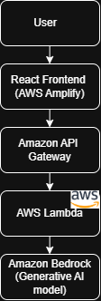
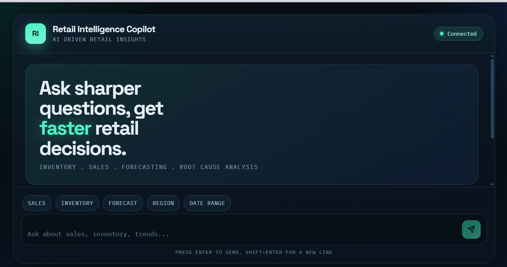
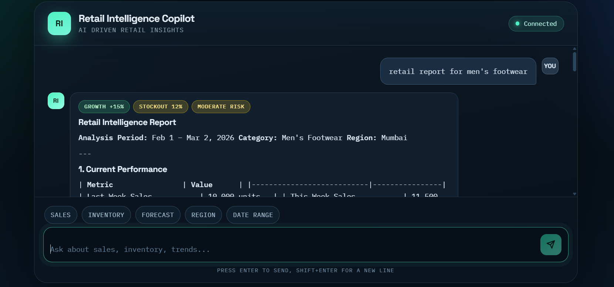
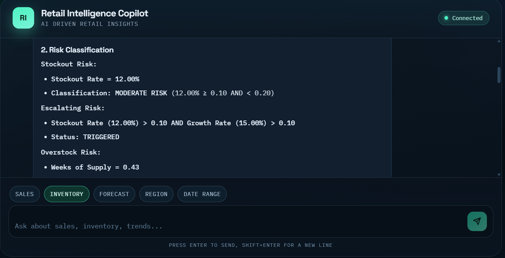

# AI-Powered Retail Intelligence Copilot

## Overview

The AI-Powered Retail Intelligence Copilot is a Generative AI-powered analytics assistant designed to help retail businesses make data-driven decisions through natural language queries.

Instead of relying on complex dashboards, retailers can simply ask questions such as:

- "Show inventory risks across categories"
- "Analyze footwear sales performance"
- "Forecast next 30 days demand"

The system analyzes retail signals like sales growth, inventory levels, stockout rates, and margins to generate structured executive insights.

This prototype demonstrates how Generative AI can act as a decision-support engine for modern retail operations.

---

## Problem Statement

Retail businesses, especially small and mid-sized retailers, face several operational challenges:

- Inventory mismanagement (stockouts & overstock)
- Poor demand forecasting
- Delayed business insights
- Complex analytics tools that require technical expertise

These issues often result in lost revenue and inefficient inventory decisions.

Retailers need a simple and intelligent way to interpret their data and act quickly.

---

## Solution

The AI-Powered Retail Intelligence Copilot uses Generative AI to transform retail data signals into executive-level insights.

Users can interact with the system through natural language queries, and the AI engine analyzes the available data to provide:

- Risk classification
- Demand forecasting
- Financial impact estimation
- Decision recommendations
- Scenario simulations

The system acts as an AI co-pilot for retail decision making.

---

## Key Features

- Natural language retail analytics
- Inventory risk detection (stockouts & overstock)
- 30-day demand forecasting
- Financial impact estimation
- Scenario-based decision insights
- Anomaly detection in retail performance
- Executive-level structured reports

---

## System Architecture

The system follows a serverless cloud architecture powered by AWS. 

### Architecture Components

**Frontend**
- React + Vite
- Hosted on AWS Amplify

**API Layer**
- Amazon API Gateway handles API requests

**Backend**
- AWS Lambda processes queries and prepares AI prompts

**AI Engine**
- Amazon Bedrock (Foundation Model) generates structured retail insights

---

## Technologies Used

Frontend
- React
- Vite
- JavaScript

Backend
- AWS Lambda
- Node.js

Cloud Infrastructure
- AWS Amplify
- Amazon API Gateway
- Amazon Bedrock

AI & Analytics
- Generative AI prompting
- Retail analytics logic
- Forecast calculations

---

## How Generative AI is Used

Generative AI powers the analytics engine by interpreting retail signals and generating structured insights.

The AI model performs:

- Risk classification based on inventory metrics
- Demand forecasting using sales growth signals
- Financial impact estimation from stockout data
- Scenario-based decision analysis
- Anomaly detection in retail performance

This allows business users to obtain advanced analytics through simple natural language queries.

---

## Example Queries

Users can ask questions such as:

- Show inventory risks across categories
- Analyze footwear sales performance
- Forecast next 30 days demand
- Detect anomalies in sales growth
- Summarize sales of men's footwear

The AI generates a structured retail intelligence report in response.

---

## Live Prototype

The AI Retail Intelligence Copilot prototype is deployed on AWS using a serverless architecture (AWS Amplify, API Gateway, AWS Lambda, and Amazon Bedrock).

For hackathon evaluation, the live prototype link has been provided in the official submission portal and demo video.

---

## Prototype Screenshots

### AI Retail Intelligence Interface

### AI Generated Retail Report

## Future Improvements

Future development of the system may include:

- Integration with real retail POS data
- Multi-language support for Bharat retailers
- Real-time streaming analytics
- Product-level demand forecasting
- AI-driven pricing optimization

---

## Author

Shrashti Dwivedi  
B.Tech Computer Science (AI & ML)  
Backend & AI Enthusiast

Prototype developed for the **AI for Bharat Hackathon**.
