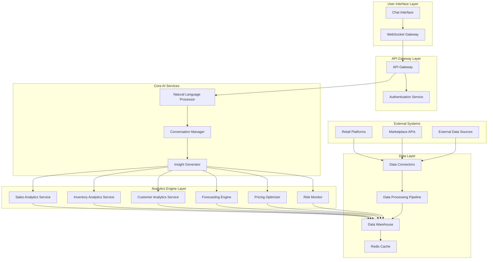

# Design Document: AI-Powered Retail Intelligence Copilot

## Overview

The AI-powered retail intelligence copilot is a conversational analytics platform that transforms complex retail data into actionable insights through natural language interactions. The system employs a microservices architecture with specialized AI components for analytics, forecasting, and recommendation generation, eliminating the need for traditional dashboards by providing intelligent, context-aware conversations about business performance.

The platform integrates with existing retail and marketplace systems to provide unified insights across sales channels, inventory management, customer behavior, and market trends. By leveraging modern conversational AI patterns and retail-specific analytics engines, the system delivers personalized recommendations that adapt to each business's unique characteristics and performance patterns.

## Architecture

The system follows a modular microservices architecture with clear separation between data ingestion, AI processing, and user interaction layers. This design enables scalability, maintainability, and the ability to enhance individual components without affecting the entire system.



## Components and Interfaces

### Chat Interface Component
The primary user interaction layer that provides a conversational experience for accessing retail intelligence. Built as a responsive web application with real-time messaging capabilities.

**Key Responsibilities:**
- Render conversational UI with message history
- Handle user input validation and formatting
- Display rich content including charts, tables, and recommendations
- Manage WebSocket connections for real-time updates
- Provide typing indicators and message status feedback

**Interface Contracts:**
```typescript
interface ChatMessage {
  id: string;
  userId: string;
  content: string;
  timestamp: Date;
  type: 'user' | 'assistant' | 'system';
  metadata?: {
    insights?: InsightData[];
    recommendations?: Recommendation[];
    charts?: ChartConfig[];
  };
}

interface ChatSession {
  sessionId: string;
  userId: string;
  context: ConversationContext;
  messages: ChatMessage[];
  createdAt: Date;
  lastActivity: Date;
}
```

### Natural Language Processor
Processes user queries to extract intent, entities, and context for routing to appropriate analytics services. Utilizes modern NLP models for understanding retail-specific terminology and business contexts.

**Key Responsibilities:**
- Parse natural language queries into structured requests
- Extract business entities (products, time periods, metrics)
- Determine user intent and required analytics operations
- Maintain conversation context across multiple exchanges
- Handle ambiguous queries with clarifying questions

**Interface Contracts:**
```typescript
interface QueryAnalysis {
  intent: AnalyticsIntent;
  entities: BusinessEntity[];
  timeframe: TimeRange;
  metrics: string[];
  confidence: number;
  clarificationNeeded?: string[];
}

interface BusinessEntity {
  type: 'product' | 'category' | 'customer_segment' | 'channel' | 'location';
  value: string;
  confidence: number;
}
```

### Conversation Manager
Orchestrates multi-turn conversations, maintains context, and coordinates between different analytics services to provide coherent responses.

**Key Responsibilities:**
- Manage conversation state and context
- Route queries to appropriate analytics services
- Aggregate responses from multiple services
- Generate coherent natural language responses
- Handle conversation flow and follow-up questions

### Analytics Engine Services
Specialized microservices for different aspects of retail intelligence, each optimized for specific analytical tasks.

#### Sales Analytics Service
**Interface:**
```typescript
interface SalesAnalyticsRequest {
  timeframe: TimeRange;
  products?: string[];
  channels?: string[];
  metrics: SalesMetric[];
}

interface SalesInsight {
  metric: string;
  value: number;
  trend: TrendDirection;
  comparison: ComparisonData;
  explanation: string;
  recommendations?: string[];
}
```

#### Inventory Analytics Service
**Interface:**
```typescript
interface InventoryAnalysisRequest {
  products?: string[];
  locations?: string[];
  analysisType: 'current_status' | 'optimization' | 'risk_assessment';
}

interface InventoryInsight {
  product: string;
  currentStock: number;
  optimalStock: number;
  daysOfSupply: number;
  riskLevel: RiskLevel;
  recommendations: InventoryAction[];
}
```

#### Customer Analytics Service
**Interface:**
```typescript
interface CustomerAnalysisRequest {
  segments?: string[];
  timeframe: TimeRange;
  analysisType: 'behavior' | 'lifetime_value' | 'churn_risk';
}

interface CustomerInsight {
  segment: string;
  metrics: CustomerMetric[];
  behaviorPatterns: BehaviorPattern[];
  recommendations: CustomerAction[];
}
```

### Data Connectors
Handles integration with external retail and marketplace platforms, providing unified data access across multiple channels.

**Key Responsibilities:**
- Authenticate with external APIs securely
- Extract data from various platform formats
- Handle rate limiting and API versioning
- Provide real-time and batch data synchronization
- Maintain data quality and consistency

**Interface Contracts:**
```typescript
interface DataConnector {
  platformType: PlatformType;
  authenticate(credentials: PlatformCredentials): Promise<boolean>;
  extractSalesData(timeframe: TimeRange): Promise<SalesData[]>;
  extractInventoryData(): Promise<InventoryData[]>;
  extractCustomerData(timeframe: TimeRange): Promise<CustomerData[]>;
}

interface PlatformCredentials {
  apiKey?: string;
  oauth?: OAuthTokens;
  webhook?: WebhookConfig;
}
```

## Data Models

### Core Business Entities

```typescript
interface Product {
  id: string;
  sku: string;
  name: string;
  category: string;
  subcategory?: string;
  brand?: string;
  price: number;
  cost?: number;
  attributes: Record<string, any>;
  createdAt: Date;
  updatedAt: Date;
}

interface SalesTransaction {
  id: string;
  productId: string;
  customerId?: string;
  quantity: number;
  unitPrice: number;
  totalAmount: number;
  channel: string;
  location?: string;
  timestamp: Date;
  metadata: Record<string, any>;
}

interface InventoryRecord {
  productId: string;
  location: string;
  quantityOnHand: number;
  quantityReserved: number;
  quantityAvailable: number;
  reorderPoint: number;
  maxStock: number;
  lastUpdated: Date;
}

interface Customer {
  id: string;
  segment: string;
  acquisitionDate: Date;
  lifetimeValue: number;
  averageOrderValue: number;
  purchaseFrequency: number;
  lastPurchaseDate?: Date;
  riskScore: number;
  preferences: CustomerPreferences;
}
```

### Analytics Data Models

```typescript
interface TimeSeriesData {
  timestamp: Date;
  metric: string;
  value: number;
  dimensions: Record<string, string>;
}

interface Forecast {
  metric: string;
  timeframe: TimeRange;
  predictions: ForecastPoint[];
  confidence: number;
  methodology: string;
  assumptions: string[];
}

interface ForecastPoint {
  timestamp: Date;
  predictedValue: number;
  confidenceInterval: {
    lower: number;
    upper: number;
  };
}

interface Recommendation {
  id: string;
  type: RecommendationType;
  priority: Priority;
  title: string;
  description: string;
  expectedImpact: ImpactEstimate;
  actionItems: ActionItem[];
  validUntil?: Date;
}

interface RiskAlert {
  id: string;
  type: RiskType;
  severity: Severity;
  title: string;
  description: string;
  affectedEntities: string[];
  detectedAt: Date;
  mitigationActions: ActionItem[];
}
```

### Conversation Data Models

```typescript
interface ConversationContext {
  userId: string;
  businessProfile: BusinessProfile;
  currentTopic?: string;
  recentQueries: QueryHistory[];
  preferences: UserPreferences;
  sessionData: Record<string, any>;
}

interface BusinessProfile {
  businessType: 'retail' | 'marketplace' | 'hybrid';
  size: 'small' | 'medium' | 'large';
  categories: string[];
  channels: string[];
  seasonality: SeasonalityPattern[];
  kpis: string[];
}
```

Now I need to use the prework tool to analyze the acceptance criteria before writing the Correctness Properties section:

<function_calls>
<invoke name="prework">
<parameter name="featureName">retail-intelligence-copilot

## Correctness Properties

*A property is a characteristic or behavior that should hold true across all valid executions of a system—essentially, a formal statement about what the system should do. Properties serve as the bridge between human-readable specifications and machine-verifiable correctness guarantees.*

After analyzing the acceptance criteria, I've identified the following testable properties while eliminating redundancy through property reflection. Many properties that initially appeared separate actually test the same underlying behaviors and have been consolidated into comprehensive properties that provide unique validation value.

### Sales Analytics Properties

**Property 1: Sales insight generation completeness**
*For any* sales query with valid data, the Analytics_Engine should generate insights that include specific metrics, time periods, actionable context, and when applicable, category-specific breakdowns and historical comparisons
**Validates: Requirements 1.1, 1.3, 1.4, 1.5**

**Property 2: Sales pattern detection accuracy**
*For any* sales dataset containing known trends, patterns, or anomalies, the Insight_Generator should correctly identify and report these patterns
**Validates: Requirements 1.2**

### Inventory Management Properties

**Property 3: Inventory analysis and recommendation completeness**
*For any* inventory inquiry, the system should analyze stock levels against sales velocity and provide reorder recommendations with proper calculations
**Validates: Requirements 2.1, 2.2**

**Property 4: Inventory risk detection and response**
*For any* inventory dataset, when slow-moving items or stockout risks are present, the Risk_Monitor should detect these conditions and provide appropriate alerts with mitigation strategies
**Validates: Requirements 2.3, 2.4**

**Property 5: Seasonal inventory adjustment**
*For any* inventory analysis where seasonal patterns exist in the data, the Analytics_Engine should incorporate seasonality into recommendations
**Validates: Requirements 2.5**

### Customer Analytics Properties

**Property 6: Customer behavior analysis completeness**
*For any* customer behavior query, the Analytics_Engine should analyze purchase patterns, frequency, segments, and provide insights about high-value customers and at-risk segments
**Validates: Requirements 3.1, 3.2**

**Property 7: Customer insight explanation and strategy generation**
*For any* customer analysis, the system should explain behavioral changes in natural language and provide actionable retention strategies when lifetime value is calculated
**Validates: Requirements 3.3, 3.4**

**Property 8: Customer feedback correlation**
*For any* scenario where both customer feedback and purchase behavior data are available, the Copilot_System should correlate feedback with purchase behavior
**Validates: Requirements 3.5**

### Forecasting Properties

**Property 9: Demand forecast generation and transparency**
*For any* demand forecast request with historical data, the Forecast_Engine should generate predictions with confidence intervals, explain assumptions, and incorporate seasonal and market condition adjustments when applicable
**Validates: Requirements 4.1, 4.2, 4.3, 4.4**

**Property 10: Forecast performance tracking**
*For any* scenario where forecast accuracy can be measured against actual results, the Copilot_System should track and report prediction performance
**Validates: Requirements 4.5**

### Pricing Optimization Properties

**Property 11: Pricing analysis and recommendation completeness**
*For any* pricing advice request, the Pricing_Optimizer should analyze competitor prices, demand elasticity, and profit margins, then provide recommendations with rationale and expected impact
**Validates: Requirements 5.1, 5.2**

**Property 12: Dynamic pricing response and tracking**
*For any* scenario with changing market conditions or promotional opportunities, the system should suggest appropriate price adjustments or discount strategies and track performance against predictions when changes are implemented
**Validates: Requirements 5.3, 5.4, 5.5**

### Risk Management Properties

**Property 13: Risk detection and alert completeness**
*For any* business scenario containing detectable risks (inventory, financial, or market), the Risk_Monitor should generate alerts with appropriate severity levels, context explanations, and mitigation recommendations
**Validates: Requirements 6.1, 6.2, 6.3, 6.4, 6.5**

### Conversational Interface Properties

**Property 14: Natural language processing and response quality**
*For any* user message, the Chat_Interface should process natural language queries and respond conversationally using clear, business-focused language appropriate for retail sellers
**Validates: Requirements 7.1, 7.2**

**Property 15: Information formatting and context maintenance**
*For any* complex data presentation or follow-up question, the Chat_Interface should format information in digestible chunks and maintain conversation context across multiple exchanges
**Validates: Requirements 7.3, 7.4**

**Property 16: Clarification handling**
*For any* ambiguous or unclear user query, the Chat_Interface should ask clarifying questions to better understand user intent
**Validates: Requirements 7.5**

### Data Integration Properties

**Property 17: Platform integration and data validation**
*For any* external platform connection, the Data_Connector should authenticate securely, retrieve data, validate data quality, and handle missing or inconsistent information appropriately
**Validates: Requirements 8.1, 8.2**

**Property 18: Multi-platform data consolidation**
*For any* scenario with multiple connected platforms, the Analytics_Engine should consolidate data across all channels for unified insights
**Validates: Requirements 8.3**

**Property 19: Real-time data processing**
*For any* scenario where real-time data is available, the Copilot_System should provide up-to-date insights based on current information
**Validates: Requirements 8.5**

### Decision Support Properties

**Property 20: Recommendation prioritization and explanation**
*For any* recommendation scenario, the Recommendation_Engine should prioritize actions based on potential business impact and explain trade-offs when multiple options exist
**Validates: Requirements 9.1, 9.2**

**Property 21: Recommendation tracking and conflict resolution**
*For any* implemented recommendation or conflicting recommendation scenario, the Analytics_Engine should track outcomes and provide conflict resolution strategies when recommendations conflict
**Validates: Requirements 9.3, 9.5**

**Property 22: Urgency detection**
*For any* scenario requiring urgent decisions, the Copilot_System should highlight time-sensitive opportunities and risks appropriately
**Validates: Requirements 9.4**

### Learning and Adaptation Properties

**Property 23: Feedback learning and model adaptation**
*For any* user interaction with feedback or emerging business patterns, the Copilot_System should learn from feedback, adjust future recommendations, and adapt models to better reflect business characteristics
**Validates: Requirements 10.1, 10.3**

**Property 24: Outcome correlation and confidence communication**
*For any* measurable business outcome or accuracy improvement, the Analytics_Engine should correlate results with previous recommendations and communicate increased confidence levels appropriately
**Validates: Requirements 10.2, 10.4**

**Property 25: Data source integration**
*For any* new data source that becomes available, the Analytics_Engine should incorporate the additional information to enhance insights
**Validates: Requirements 10.5**

## Error Handling

The system implements comprehensive error handling across all layers to ensure reliable operation and graceful degradation when issues occur.

### Data Layer Error Handling
- **Connection Failures**: Implement exponential backoff retry logic for external API connections
- **Data Quality Issues**: Validate incoming data and flag inconsistencies for manual review
- **Rate Limiting**: Respect API rate limits and queue requests when necessary
- **Authentication Errors**: Provide clear error messages and re-authentication flows

### Analytics Engine Error Handling
- **Insufficient Data**: Gracefully handle scenarios with limited historical data
- **Model Failures**: Fallback to simpler analytical methods when complex models fail
- **Computation Errors**: Validate analytical results and flag unrealistic outputs
- **Performance Degradation**: Implement timeouts and circuit breakers for long-running analyses

### Conversation Interface Error Handling
- **Ambiguous Queries**: Ask clarifying questions rather than making assumptions
- **Unsupported Requests**: Clearly communicate system limitations and suggest alternatives
- **Context Loss**: Recover conversation context from previous interactions when possible
- **Response Generation Failures**: Provide fallback responses and escalation options

### System-Wide Error Handling
- **Service Unavailability**: Implement health checks and graceful service degradation
- **Data Inconsistency**: Detect and resolve conflicts between different data sources
- **Security Violations**: Log security events and implement appropriate access controls
- **Performance Issues**: Monitor system performance and scale resources automatically

## Testing Strategy

The testing strategy employs a dual approach combining unit testing for specific scenarios with property-based testing for comprehensive validation of universal behaviors.

### Property-Based Testing
Property-based tests validate the correctness properties defined above using randomized inputs to ensure the system behaves correctly across all possible scenarios. Each property test will run a minimum of 100 iterations to provide statistical confidence in the results.

**Testing Framework**: We will use Hypothesis (Python) for property-based testing, configured to generate realistic retail data scenarios including edge cases and boundary conditions.

**Test Configuration**:
- Minimum 100 iterations per property test
- Custom generators for retail-specific data types (products, sales transactions, customer profiles)
- Shrinking enabled to find minimal failing examples
- Each test tagged with format: **Feature: retail-intelligence-copilot, Property {number}: {property_text}**

### Unit Testing
Unit tests focus on specific examples, integration points, and error conditions that complement the property-based tests:

**Core Functionality Tests**:
- API endpoint validation with known inputs and expected outputs
- Data transformation accuracy with sample datasets
- Authentication and authorization flows
- Error handling with specific failure scenarios

**Integration Tests**:
- End-to-end conversation flows with realistic user interactions
- External API integration with mock services
- Database operations with test data
- Real-time data processing with simulated events

**Performance Tests**:
- Response time validation for typical queries
- Concurrent user handling
- Large dataset processing capabilities
- Memory usage optimization

### Test Data Management
- Synthetic data generation for realistic retail scenarios
- Anonymized production data samples for integration testing
- Automated test data refresh and cleanup procedures
- Data privacy compliance in all testing activities

The combination of property-based and unit testing ensures both broad correctness validation and specific scenario coverage, providing confidence in the system's reliability and accuracy across all retail intelligence use cases.